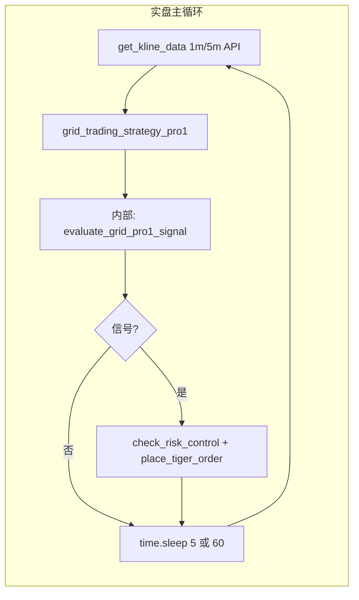
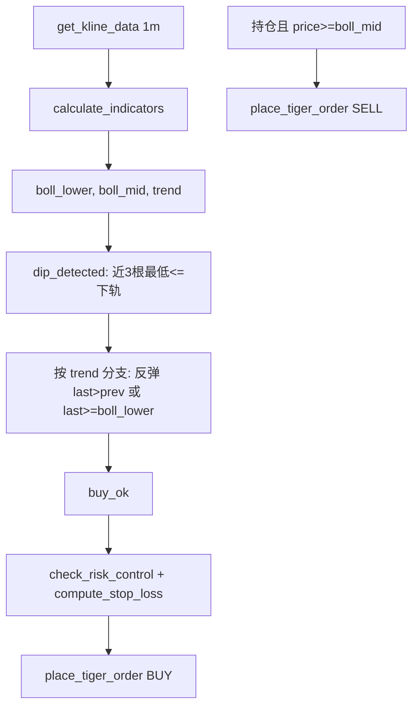
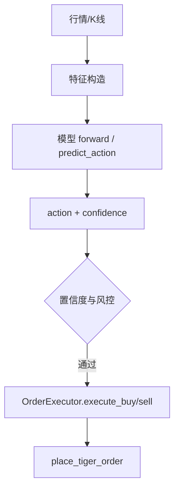
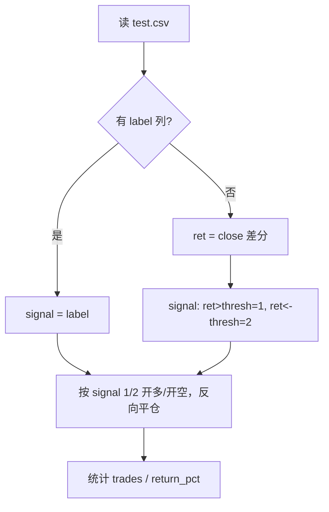

# 回测与实盘：输入、处理流程、算法对比

> **从目的上对齐一致**：同一套信号、同一套数据粒度（K 线 + 有则 tick）、同一套「决策节奏」。实盘 sleep(N) 在回测里**不真等**，用**虚拟时间前进 N 秒 + 按时间戳取数**模拟；数据文件有时间戳，按「时间戳 ≤ 当前虚拟时间」取数即可。

**输入数据里是否有成交量（volume）**：有。  
- **K 线**：`get_kline_data` 返回的 DataFrame 列为 `open, high, low, close, volume`；API 的 bar 含 `volume`，回测用 CSV 时 `load_klines_from_file` 若无 volume 列则填 0。  
- **Tick**：`get_tick_data` 返回列含 `price, volume, side`（实盘 API 或 mock 均有 volume）。  
- **预处理/训练**：`data_preprocessing` 使用 `volume`（或 `volume_1m`）做特征；train/val/test.csv 中若有 volume 列会参与特征与目标。  
- **实盘 current_data**：`MarketDataProvider.get_market_data()` 已把 `indicators['1m']['volume']`、`indicators['5m']['volume']` 写入 `current_data['volume_1m']`、`current_data['volume_5m']`，供策略 `prepare_features` 使用。

---

## 1. Grid 策略

### 1.1 实盘（grid_trading_strategy_pro1）

**入口**：`src/tiger1.py` → `grid_trading_strategy_pro1()`，由**主循环**按固定间隔调用。

**主循环（与回测不同）**：



- **数据**：`get_kline_data([FUTURE_SYMBOL], '1min', count=30)` 与 `'5min', count=50`（API），拿到的是**当前最新**的 1m/5m K 线（最后一根 1m 可能是**未收盘**的）。
- **调用频率**：`tiger1` 主循环里 **每 5 秒** 执行一次「拉数据 → 策略 → sleep(5)`；部分脚本为每 60 秒。
- **Tick**：Grid 策略**不使用** tick；只用 K 线。其他策略（如 LLM）会用 `get_tick_data`，与 Grid 回测无关。

**单次策略内部**：`calculate_indicators` → `judge_market_trend` → `adjust_grid_interval` → near_lower / rsi_ok / trend_check / rebound / vol_ok → `check_risk_control` → `compute_stop_loss` → `place_tiger_order`。这部分与回测共用的 `evaluate_grid_pro1_signal` 一致。

---

### 1.2 回测（backtest_grid_trading_strategy_pro1）— 从目的上对齐

**目标**：与实盘同一套信号、同一套数据粒度、同一套决策节奏；sleep 不真等，用虚拟时间 + 按时间戳取数模拟。  
**入口**：`backtest_grid_trading_strategy_pro1(single_csv_path=..., step_seconds=5, csv_path_tick=...)`。`step_seconds>0` 时虚拟时间每步前进 N 秒，按时间戳取数；`csv_path_tick` 可选，用 `load_ticks_from_file` 加载 tick（训练有 tick 回测也应有）。

**主循环（与实盘不同）**：

```mermaid
flowchart LR
    subgraph 回测主循环
        B1[load 1m/5m 或 单CSV重采样] --> B2[for i 逐根 1m bar]
        B2 --> B3[sub1=df_1m.iloc[:i+1], sub5 对齐]
        B3 --> B4[evaluate_grid_pro1_signal sub1, sub5]
        B4 --> B5{买信号?}
        B5 -->|是| B6[向前 lookahead 判定 win/loss]
        B5 -->|否| B7[i+=1 下一根 bar]
        B6 --> B7
        B7 --> B2
    end
```

- **主循环（step_seconds>0 时）**：虚拟时间 → 取「时间戳 ≤ virtual_time」的 1m/5m/tick → evaluate_grid_pro1_signal → 有信号则向前 lookahead 判 win/loss → virtual_time += step_seconds（不真 sleep）。实盘「等 N 秒」在回测里等价于「时间戳往前走 N 秒再按时间戳取数」。

---

### 1.3 一致项（从目的上对齐后）

| 项目 | 实盘 | 回测（step_seconds>0 + csv_path_tick 可选） |
|------|------|--------------------------------------------|
| **信号与公式** | evaluate_grid_pro1_signal | 同一函数 |
| **数据粒度** | K 线；需要时 tick | K 线 + 可选 tick（load_ticks_from_file） |
| **决策节奏** | 每 N 秒一次（sleep 后取数） | 虚拟时间每 N 秒前进，按时间戳取数，等价 |
| **取数方式** | 当前时刻「最新」数据 | 时间戳 ≤ virtual_time 的数据 |

### 1.4 Tick 与 Sleep 说明

- **Tick**：训练/采集已有 tick（如 `tick_data_collector`、`SIL2603_ticks_*.csv`），回测通过 `csv_path_tick` 加载同一类文件；有 tick 的回测与实盘在数据层一致。
- **Sleep**：实盘 `time.sleep(N)` 真实等待；回测不等待，**虚拟时间 += N 秒**，再用数据文件里**时间戳 ≤ 虚拟时间**的 1m/5m（及 tick）做下一步，逻辑上与「每 N 秒看一次盘」一致。

### 1.5 Grid 小结

- **一致**：同一套 `evaluate_grid_pro1_signal`；同一套数据粒度（K 线 + 有则 tick）；同一套决策节奏（step_seconds 模拟 sleep，按时间戳取数）。
- **实现要点**：回测支持 `step_seconds`、`csv_path_tick`；数据文件带时间戳；循环内用「虚拟时间前进 N 秒 + 按时间戳取数」替代真实 sleep。

---

## 2. BOLL 策略

### 2.1 实盘（boll1m_grid_strategy）

**入口**：`src/tiger1.py` → `boll1m_grid_strategy()`

**输入**：
- 1 分钟 K 线：`get_kline_data([FUTURE_SYMBOL], '1min', count=...)`（至少 GRID_BOLL_PERIOD+5 根）
- 指标里用 5m：`calculate_indicators(df_1m, df_1m)` 仍会产出 '5m' 的 boll_lower/boll_mid 等

**处理流程与算法**：



**用到的函数**：`get_kline_data` → `calculate_indicators` → `judge_market_trend` → 本函数内 dip_detected / trend 分支 / buy_ok → `check_risk_control` → `compute_stop_loss` → `place_tiger_order`。

---

### 2.2 回测（当前报告用的 boll 来源）

**入口**：同 grid，`parameter_grid_search.grid_search_optimal_params('boll')`

**输入与处理**：与 **Grid 回测完全一样**：同一份 `test.csv`、同一套 `backtest_with_params`（RSI + 双均线），**没有** boll_lower/boll_mid、dip_detected、trend 分支等任何 boll 专用逻辑。

---

### 2.3 BOLL：回测 vs 实盘 差异小结

| 项目       | 实盘 | 回测（parameter_grid_search） |
|------------|------|--------------------------------|
| 输入       | 1m K 线，指标含 5m BOLL | 同 grid：单表 test.csv close |
| 信号逻辑   | 下轨 dip + 按 trend 的反弹条件，卖在中轨 | 与 grid 相同：均线+RSI，**无 BOLL** |
| 代码路径   | tiger1.boll1m_grid_strategy | 与 grid 共用 backtest_with_params，**无 boll 专用逻辑** |

结论：**BOLL 回测和实盘也不是同一套逻辑；回测甚至没有区分 grid 与 boll，两者共用同一套 RSI+MA。**  

---

## 3. MoE Transformer / LSTM 策略

### 3.1 实盘（moe_transformer / lstm）

**入口**：主流程里 `TradingExecutor` 或策略分支，加载对应策略（MoE 或 LSTM），用**当前行情/特征**做推理。

**输入**：
- 实时或周期拉取的 K 线 / tick / 特征（由 `MarketDataProvider` 等提供）
- 模型输入：多时间尺度特征等（各策略实现不同）

**处理流程与算法**：



**用到的函数**：数据层 → 策略类 `.predict_action(current_data)` → 执行层 `OrderExecutor` → `place_tiger_order`（或 tiger1 内等价路径）。

---

### 3.2 回测（当前报告用的 moe/lstm 来源）

**入口**：`scripts/backtest_model_strategies.run_backtest_model_strategies()`

**输入**：
- 同一份 `data/processed/test.csv`
- 信号来源：**优先用列 `label`**（0=持，1=多，2=空）；**若无 label**则用下一档收益率推导（ret>thresh→1，ret<-thresh→2）

**处理流程与算法**：



**用到的函数**：仅 `backtest_model_strategies` 内逻辑；**没有**加载 MoE/LSTM 模型，**没有** `predict_action`，**没有** 实盘那套特征与模型推理。

---

### 3.3 MoE/LSTM：回测 vs 实盘 差异小结

| 项目       | 实盘 | 回测（backtest_model_strategies） |
|------------|------|-----------------------------------|
| 输入       | 实时/周期行情 → 特征 → 模型输入 | test.csv 的 close（及可选 label） |
| 处理       | 模型 forward / predict_action | 无模型：用 label 或收益率推导的 0/1/2 |
| 代码路径   | 策略类 + OrderExecutor + tiger1 | 仅脚本内信号循环，**与实盘无共用** |

结论：**回测没有走“同一套模型+同一套特征”，只是用同一份 CSV 上的规则信号模拟多空，和实盘算法不一致。**

---

## 4. 总表：四策略回测 vs 实盘

| 策略            | 实盘入口（代码）              | 回测入口（代码）                          | 输入是否一致 | 处理/算法是否一致 |
|-----------------|------------------------------|-------------------------------------------|--------------|-------------------|
| Grid            | tiger1.grid_trading_strategy_pro1 | backtest_grid_trading_strategy_pro1（from_file/single_csv） | 来源不同；实盘可有未收盘K线 | **信号公式一致**（共用 evaluate_grid_pro1_signal）；**循环/时间/tick 不一致**（见 1.3） |
| BOLL            | tiger1.boll1m_grid_strategy   | 同上（与 grid 共用）                      | 否           | 否（BOLL 下轨/中轨 vs 均线+RSI） |
| MoE Transformer | TradingExecutor + MoE 策略    | backtest_model_strategies                 | 否（行情→特征 vs CSV） | 否（无模型，用 label/收益推导） |
| LSTM            | 策略分支 + LSTM predict       | 同上（与 MoE 共用同一脚本）              | 否           | 否（无模型） |

---

## 5. 设计文档里有没有流程图？

- **设计_网格与BOLL策略.md**：有算法与数据流文字描述，**没有** mermaid/流程图；回测部分只写了“parameter_grid_search”“历史 K 线”，没有画实盘 vs 回测的流程对比。
- **设计_MoE策略.md / 设计_LSTM策略.md**：有训练/推理描述，**没有**“实盘运行流程 vs 当前回测流程”的对比图。

本文档即补充：**四策略各自的回测输入/处理流程/算法 vs 实盘输入/处理流程/算法**，用流程图和上表标出差异，便于你决定怎么改（例如：回测是否改为调用实盘同套逻辑、或统一入口与数据格式等）。

---

## 6. 训练 vs 实盘：同一前向为何会“输入不一致”（按策略说明）

训练和推理用的是**同一套前向**：都是 `prepare_features(某个 dict/row)` 得到特征向量，再 `model(特征)`。代码上只有一条路径，没有“训练用一套特征、推理用另一套”的两套实现。  
不一致只可能来自：**传入 prepare_features 的那个 dict/row 的“键”不同**——训练时是 CSV 的一行（键 = CSV 列名），推理时是实盘的 `current_data`（键 = `MarketDataProvider.get_market_data()` 里填的）。  
`prepare_features` 里用 `row.get(key, default)` / `get_value_safe(key, default)`：**键不存在就取 default（常为 0）**。所以：某 key 在训练 CSV 有、实盘没有 → 训练有值、推理 0；某 key 实盘有、训练 CSV 没有 → 训练 0、推理有值。同一前向、同一行代码，就会因为“两边的键集合不同”而得到不同的数值，从而造成训练/推理输入分布不一致，影响效果。

下面按策略分开说：谁用同一前向、训练/推理各从哪里取“那一行/那个 dict”、键集合差异在哪、当前是否已对齐、以后改数据要注意什么。

---

### 6.1 网格策略（Grid）/ BOLL 策略

- **是否有“训练 + 推理”的模型前向**：无。纯规则（网格/BOLL 条件判断），没有 `prepare_features` 喂神经网络的流程。
- **结论**：不涉及“训练输入 vs 推理输入”是否一致的问题。

---

### 6.2 Enhanced / Large / Huge Transformer 策略

- **前向是否一致**：一致。训练时 `train_model(df)` 里对每一行 `row` 调 `prepare_features(row)`，推理时 `predict_action(current_data)` 里调 `prepare_features(current_data)`，是同一个函数。
- **prepare_features 用到的键（12 维）**：  
  `price_current`, `atr`, `rsi_1m`, `rsi_5m`, `boll_upper`, `boll_mid`, `boll_lower`, `boll_position`, `price_change_1`, `price_change_5`, `volatility`, `volume_1m`。  
  后 7 个用 `row.get(key, 0)` 或 0.5，缺键就默认。
- **训练时传入的 row 从哪来、有哪些键**：  
  `load_training_data()` 读的是 `trading_data/YYYY-MM-DD/` 下的 `trading_data_*.csv`（或 extended / prepared_features）。  
  这些 CSV 若来自 **data_collector**（跑 grid 时采集），列只有：`timestamp`, `price_current`, `grid_lower`, `grid_upper`, `atr`, `rsi_1m`, `rsi_5m`, `buffer`, `threshold`, `near_lower`, `rsi_ok`, `trend_check`, `rebound`, `vol_ok`, …，**没有** `boll_*`, `price_change_1`, `price_change_5`, `volatility`, `volume_1m`。  
  所以训练时：前 5 个键有值，后 7 个全是 default（0 或 0.5）。
- **推理时传入的 current_data 有哪些键**：  
  `MarketDataProvider.get_market_data()` 构造的 `current_data` 只有：`price_current`, `tick_price`, `grid_lower`, `grid_upper`, `atr`, `rsi_1m`, `rsi_5m`, `buffer`, `threshold`, `near_lower`, `rsi_ok`, `kline_price`。  
  **也没有** `boll_*`, `price_change_1`, `price_change_5`, `volatility`, `volume_1m`。  
  所以推理时：同样是前 5 个有值，后 7 个 default。
- **当前是否一致**：是。训练和推理“缺的键”相同，同一前向下 12 维里 5 维有值、7 维 default，两边对齐。
- **以后若改数据**：若在 data_provider 里增加并写入 `boll_*`、`volatility`、`volume_1m` 等到 `current_data`，而训练用的 CSV 没有这些列，就会出现“推理有值、训练一直是 0”的分布不一致。要同步在采集/扩展 CSV 时写入相同列。

---

### 6.3 LLM 策略（hybrid 模式）/ MoE 策略

- **前向是否一致**：一致。MoE 直接复用 LLM 的 `prepare_features`。训练时 `train_model(df)` 对每行 `prepare_features(row)`，推理时 `predict_action(current_data)` 调 `prepare_features(current_data)`，同一套 46 维特征逻辑。
- **prepare_features 用到的键（46 维）**：  
  hybrid 下会取：`price_current`, `tick_price`, `tick_*`, `atr_1m`/`atr`, `rsi_1m`, `rsi_5m`, `boll_*_1m/5m/1h/1d`, `volume_*`, `trend_1h`, `trend_1d`, `ma_5d`/`ma_10d`/`ma_20d`, `grid_lower`, `grid_upper` 等；缺的用 `get_value_safe(..., 0)` 或 0.5。
- **训练时 row 的键**：  
  同样来自 `load_training_data()` 的 CSV（data_collector 等）。只有约 20 列（如 `price_current`, `grid_*`, `atr`, `rsi_1m`, `rsi_5m`, `buffer`, …），**没有** `tick_*` 细粒度、`boll_*_1h/1d`、`trend_1h`、`ma_5d` 等。  
  所以 46 维里训练时只有少数维有值（price_current、tick_price 用 price_current 顶、grid、atr、rsi），其余多为 0/default。
- **推理时 current_data 的键**：  
  同上，只有 data_provider 填的那几项（如 `price_current`, `tick_price`, `grid_*`, `atr`, `rsi_1m`, `rsi_5m`, …），**没有** `boll_*_1m/5m/1h/1d`、`volume_1m`、`trend_1h`、`ma_5d` 等。  
  所以推理时也是多数维用 default。
- **当前是否一致**：大体一致。两边“缺的键”集合类似，都没有 1h/1d boll、trend、ma、大部分 tick_*，所以同一前向下都是“少量维有值、多数维 0/default”。
- **以后若改数据**：若在实盘侧给 `current_data` 增加 `boll_*_1m`、`volume_1m`、`trend_1h` 等，而训练 CSV 没有对应列，就会出现“推理多出有值维、训练仍是 0”的不一致。需要在采集或离线生成训练 CSV 时补全相同键。

---

### 6.4 其他：用 train.csv 的独立训练脚本（非策略类）

- `scripts/train_transformer.py`、`src.train_raw_features_transformer` 等用 **prepare_data 产出的 train.csv**（OHLCV + 价差/量差等），**不是**策略里的 `load_training_data()`。  
  它们训练的模型输入 = train.csv 的列（无 grid、atr、rsi、boll、tick）。  
  若这类模型被实盘用，实盘目前喂的是 `current_data`（含 grid、atr、rsi、tick_price），则**从根上就是两套特征**：不是“同一 prepare_features 键不同”，而是**完全不同的特征管道**。  
  要嘛实盘改为只喂与 train.csv 同构的特征，要嘛这类模型改为用与实盘一致的 current_data 格式（或同一 prepare_features）的数据训练。

---

### 6.5 小结（代码机制）

| 项目 | 说明 |
|------|------|
| **为何“同一前向”还能输入不一致** | 训练时 `prepare_features(CSV 的一行)`，推理时 `prepare_features(current_data)`；键 = 列名 vs 键 = provider 填的 key。缺键就用 default（0 等），所以**键集合不同**就会导致同一维在训练/推理一侧有值、一侧为 0。 |
| **按策略当前状态** | Grid/BOLL 无此问题；Enhanced/Large/Huge、LLM/MoE 当前训练与推理“缺的键”一致，输入是对齐的。 |
| **后续改数据要注意** | 若只在一侧增加新 key（例如只在 data_provider 里多写 boll、volume、trend），而不在训练 CSV 或采集逻辑里补同一批列，就会打破对齐，影响效果。 |

**结论**：从当前代码与数据源看，**训练和推理的输入数据与流程是一致的**（同一 `prepare_features`、训练 CSV 与实盘 current_data 缺键集合一致，无“两套特征管道”）。

---

### 6.6 每日例行优化在干啥、调的是哪些参数

每日例行跑的是 **`scripts/optimize_algorithm_and_profitability.py`**（或由 `daily_data_collection_and_training.py` 在最后调用其 `run_optimization_workflow`）。流程大致是：

1. **结果分析**：拉 API 历史订单算收益率、汇总 DEMO 日志与 today_yield，得到四策略的表现数据。
2. **算法优化（参数回测）**：`optimize_parameters()`  
   - **grid**：优先用与实盘同逻辑的 `tiger1.backtest_grid_trading_strategy_pro1(single_csv_path=test.csv, ...)` 做回测，得到收益/胜率/笔数；若无产出则退回到 **parameter_grid_search** 的网格搜索。  
   - **boll**：只用 **parameter_grid_search** 的网格搜索回测。  
   - **moe_transformer / lstm**：调用 `backtest_model_strategies.run_backtest_model_strategies()`，用 test.csv 做**信号回测**，只产出 num_trades/return_pct/win_rate，**不搜参**。
3. **报告**：把最优参数与回测效果写入算法优化报告，并刷新策略报告。

**在调优的“参数”是谁？**

| 项目 | 说明 |
|------|------|
| **被调优的** | 只有 **grid / boll** 的**策略规则参数**（在退路里由 `scripts/parameter_grid_search.py` 网格搜索）：`rsi_buy`, `rsi_sell`, `ma_short`, `ma_long`, `use_or`。回测逻辑是“均线 + RSI”的简化版，不是实盘 grid_trading_strategy_pro1 的网格+ATR+RSI 那套。 |
| **未被每日调优的** | **所有模型（LLM、MoE、LSTM、Enhanced/Large/Huge Transformer）的超参**：学习率、层数、hidden size、d_model、nhead、dropout 等都不在每日流程里做网格搜索或自动调优。 |

**模型超参的“优化”在哪？**

- **DataDrivenOptimizer**（`src/strategies/data_driven_optimization.py`）会根据近期 trading_data 分析市场状态（趋势强度、波动率、均值回归），给出 **model_params**（如 lstm_hidden_size、transformer_d_model、transformer_num_layers、learning_rate、dropout_rate）和 **thresholds**（min_confidence、min_price_change、max_risk_ratio）建议。  
- 该优化器**不在每日例行脚本里调用**，只在主程序以 **`strategy_type='optimize'`** 启动时执行（例如 `tiger1.py` 的 optimize 分支）。若要让“模型超参”也参与每日或周期性的自动调优，需要把 DataDrivenOptimizer 或等价逻辑接到 `optimize_algorithm_and_profitability` / 每日流程里，并决定如何把建议写回配置或模型训练入口。

以上可与第 1–4 节回测 vs 实盘对比一起，作为对齐与修改依据。
