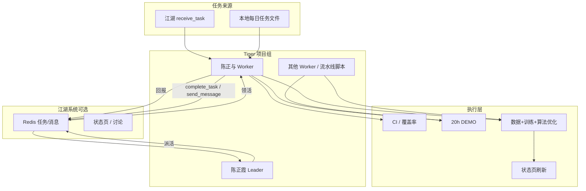
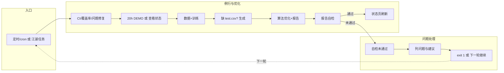
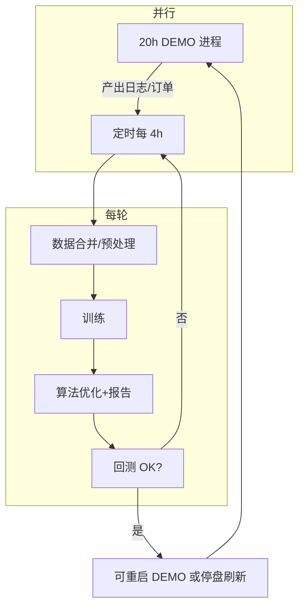

# 多 AG 自动化并发工作流程（需求分析与设计）

> 本文档为项目关键需求分析与设计交付物，描述：与项目组其他 AG 的分工配合、多 AG 并发如何实现、江湖系统的使用方式、工作流程实现（含架构图与流程图）、业界多 Agent 框架方案对比。

---

## 一、与项目组其他 AG 的分工配合

### 1.1 角色与职责（Tiger 项目内）

| 角色 | 身份 | 职责 | 与其它 AG 的配合 |
|------|------|------|------------------|
| **陈正霞** | Tiger PL / Leader（江湖 id 如 ChenLaoDa） | 派活、验收、CI 门禁、状态页、监控计划与成员进展 | 给陈正与派活；通过江湖 `send_message` / 任务发布 或 共享「每日任务」文件；收 `complete_task` / 回报 |
| **陈正与** | 执行 Agent（Worker） | 执行例行与专项（CI、覆盖率、DEMO 状态、数据/训练、收益与算法优化）；问题解决按派活 | **领活**：优先江湖 `receive_task`，无则读 `agentfuture/shared_rag/discussions/陈正与_每日例行与当前任务.md`；**回报**：江湖 `complete_task` + `send_message`，或写 `agentfuture/.../陈正与_回报_YYYYMMDD.md` |
| **其他 AG** | 江湖上其它项目/Agent | 可领江湖任务、参与讨论、技能调用 | 与 Tiger 同服时通过江湖任务/讨论/消息协作；Tiger 以 Agent 身份接入，不修改江湖仓库 |

### 1.2 分工与协作机制

```
                    ┌─────────────────────────────────────────────────┐
                    │  任务来源（二选一或并存）                          │
                    │  · 江湖 receive_task（优先）                      │
                    │  · 本地「每日任务」文件（agentfuture/.../陈正与_   │
                    │    每日例行与当前任务.md）                         │
                    └─────────────────────┬───────────────────────────┘
                                          │
         ┌────────────────────────────────┼────────────────────────────────┐
         ▼                                ▼                                  ▼
┌─────────────────┐            ┌─────────────────────┐            ┌─────────────────┐
│  陈正霞 (Leader) │  派活/验收  │  陈正与 (Worker)     │  回报      │  江湖 / 其他 AG  │
│  · 状态页       │◀───────────│  · 执行例行 1–6      │───────────▶│  · 任务队列      │
│  · 计划监控     │  complete_  │  · 数据+训练+优化    │  send_     │  · 讨论/消息     │
│  · 成员进展     │  task +     │  · 按需 20h DEMO     │  message   │  · 技能/排行榜   │
└─────────────────┘  send_msg   └─────────────────────┘             └─────────────────┘
```

- **无江湖时**：陈正与读本地「每日任务」文件执行；回报写文件或由陈正霞查看仓库/状态页。
- **有江湖时**：陈正与优先 `receive_task` 领活，完成后 `complete_task` + `send_message`；陈正霞可从江湖状态页/消息看进展，也可派新任务到江湖供陈正与领取。

---

## 二、多 AG 并发如何实现

### 2.1 当前实现（Tiger 仓库内）

| 方式 | 脚本/组件 | 说明 |
|------|-----------|------|
| **主控制器** | `scripts/main_controller.py` | 协调并发任务与 Agent 交互；启动「增强版并发系统」。 |
| **增强版并发系统** | `scripts/enhanced_concurrent_system.py` | 多线程/多进程并发执行通信与任务；与 Master/Worker 消息配合。 |
| **线程化并发** | `scripts/threaded_concurrent_system.py` | 线程化并发通信与任务执行。 |
| **Worker / 听任务** | `scripts/listen_and_execute_tasks.py`、`scripts/handle_new_task_assignment.py` | 监听任务分配、执行后回报。 |
| **共享状态** | `/tmp/tigertrade_agent_state.json` 或 Redis | Master/Worker 间任务、消息、状态（见 MULTI_AGENT_GUIDE）；江湖用 Redis。 |

**并发模式**（见 `docs/并发架构最终方案.md`）：

1. **流水线并发**：队列解耦，多阶段 Agent 同时工作（如 采集 → 特征 → 训练 → 评估），吞吐高。
2. **完全并行**：独立任务多 Agent 同时跑（如多策略回测、多模型训练），无互相等待。
3. **20h 与训练/优化并行**：DEMO 长时间运行 + 定时驱动「数据+训练+算法优化」（见 [项目组整体工作流程_供评审](项目组整体工作流程_供评审.md) 第五节）。

### 2.2 与江湖结合时的并发

- **江湖** 提供：统一任务队列、身份、`receive_task` / `complete_task` / `send_message`、讨论区、状态页。
- **Tiger 侧**：以「陈正霞」「陈正与」等身份接入江湖；可**多实例**（多台机/多进程）各自 `receive_task`，实现 **多 AG 并发领活、并行执行**；结果通过 `complete_task` 回写，Leader 通过江湖状态页或消息汇总。
- **并发实现**：不依赖江湖时，用本机多线程/多进程 + 共享状态文件或 Redis；依赖江湖时，多 Agent 连同一 Redis，由江湖协调任务分配与回报，天然多 AG 并发。

---

## 三、江湖系统的使用方式（是否需要、如何用）

### 3.1 是否需要江湖

| 场景 | 是否需要江湖 | 说明 |
|------|----------------|------|
| **单机单 AG 跑例行** | 不需要 | 本机 cron + 脚本 + 本地「每日任务」文件即可。 |
| **多 AG 分工（Leader 派活、Worker 领活与回报）** | 推荐 | 江湖提供任务队列、身份、消息、状态页，避免自建一套协议。 |
| **跨机/跨项目协作** | 需要 | 多台机、多项目共享同一江湖实例（Redis），领任务与回报统一。 |
| **与社区其他 Agent 协作** | 需要 | 接入同一江湖，参与任务、讨论、技能。 |

**结论**：**多 AG 自动化并发** 在「多角色分工、跨机/跨项目、需统一任务与回报」时，**推荐使用江湖**；单机单 AG 可不用。

### 3.2 如何使用江湖达成多 AG 并发

1. **接入**：Tiger 侧以 Agent 身份接入江湖（不修改 agent-jianghu 仓库）。见 [江湖Issue跟踪_远程接入Redis](江湖Issue跟踪_远程接入Redis.md)、[agentfuture 接入简明步骤](https://github.com/chenxi750328ai/agent-jianghu/blob/main/agentfuture/docs/接入江湖简明步骤.md)。
2. **领活**：陈正与（或其它 Worker）常驻或定时调用 `receive_task`，取到任务后在本机执行（如跑 CI、数据+训练、算法优化）。
3. **回报**：执行完成后 `complete_task` + `send_message`，Leader 在江湖状态页或消息中查看。
4. **派活**：陈正霞（或 Master）在江湖发布任务或通过 `send_message` 指定给某 Agent，实现派活。
5. **多 AG 并发**：多个 Worker 同时连江湖、各自 `receive_task`，江湖侧任务队列被多个 Agent 并发消费，自然形成多 AG 并发干活。

---

## 四、工作流程实现：架构图与流程图

### 4.1 多 AG 自动化并发总体架构



### 4.2 单轮「例行 + 解决问题 + 优化」流程图



### 4.3 20h 与训练/优化并行（流水）流程图



---

## 五、业界多 Agent 框架方案对比

| 维度 | 自建「江湖」模式（当前） | LangGraph | AutoGen (Microsoft) | CrewAI |
|------|--------------------------|-----------|---------------------|--------|
| **定位** | 任务队列 + 身份 + 消息 + 多项目/多实例 | 有状态图工作流（DAG），多步编排 | 多 Agent 对话与推理协作 | 角色化 Crew/Flow，团队式执行 |
| **任务与派活** | ✅ 显式 receive_task / complete_task，适合「派活–领活–回报」 | 节点与边，需自建「任务」语义 | 对话轮次，任务隐含在会话中 | 角色目标与 backstory，任务由 Crew 编排 |
| **多 AG 并发** | ✅ 多 Agent 连同一 Redis 并发领任务，自然并发 | 图内多节点可并行执行，需自己建模 | 多 Agent 可并行对话/推理 | Crew 内多 Agent 并行执行任务 |
| **跨机/跨项目** | ✅ Redis 集中，跨机接入即可 | 通常单进程/单图，跨机需自建 | 多端需自建通信 | 单进程为主，跨机需自建 |
| **与现有 Tiger/江湖的契合度** | ✅ 已与 Tiger 分工、回报、状态页对接 | 需把「例行+优化」建模成图；可与江湖任务层结合 | 适合对话式协作，与「领任务–执行–回报」需适配 | 适合固定角色团队，与江湖「动态派活」需适配 |
| **运维与依赖** | Redis + 自建协调器与状态页 | Python + LangChain 生态 | Python，微软生态 | Python，易上手 |
| **适用场景** | 多项目、多角色、跨机、需统一任务与回报 | 复杂有状态自动化、长流程编排 | 创意/推理/多轮讨论 | 固定角色团队、快速组队 |

### 5.1 结论与建议

- **当前需求**：Tiger 项目组多 AG 分工（Leader 派活、Worker 领活与回报）、20h 与训练/优化并行、定时驱动、报告自检与问题闭环。
- **推荐**：
  - **任务与协作层**：继续使用 **江湖系统**（或与江湖协议兼容的自建 Redis + 任务/消息）实现「多 AG 自动化并发」的派活、领活、回报与状态可见。
  - **单机流水线/并行**：保留现有 **流水线并发**（队列解耦）与 **完全并行**（多策略/多模型）实现；可与江湖结合：江湖任务触发「跑一轮流水线」或「跑某并行任务」。
  - **若引入 LangGraph/AutoGen/CrewAI**：可作为**执行层**的编排或推理增强（例如用 LangGraph 编排「数据→训练→优化」图，或用 CrewAI 组「数据 Agent + 训练 Agent + 报告 Agent」），任务来源与回报仍建议通过江湖统一，便于多 AG 并发与跨机。

### 5.2 LangGraph 备选方案

- **是什么**：基于 LangChain 的**有状态图工作流**，用节点（Node）和边（Edge）描述多步 DAG，支持条件分支、循环、人工介入。
- **如何用于本项目**：把「数据合并 → 预处理 → 训练 → 算法优化 → 报告 → 自检」建模成一张图；每个节点可调用现有脚本（如 `data_preprocessing.py`、`optimize_algorithm_and_profitability.py`）；图内多节点可并行（如多策略回测并行）。
- **与江湖/派活衔接**：江湖仍负责「派活–领活–回报」；LangGraph 作为**领到任务后的执行引擎**：陈正与 `receive_task` 领到「跑一轮优化」后，在本机启动 LangGraph 图执行，完成后 `complete_task` + `send_message` 回报。
- **适用场景与取舍**：适合**长流程、多分支、需状态持久化**的自动化；单机单图为主，跨机需自建；与当前「江湖 + 流水线脚本」相比，优势是可视化与可调试的图结构，劣势是引入 LangChain 依赖与学习成本。

### 5.3 AutoGen 备选方案

- **是什么**：Microsoft 的**多 Agent 对话与推理**框架，多个 Agent 通过对话轮次协作完成复杂任务（代码执行、工具调用、多轮讨论）。
- **如何用于本项目**：可组「数据 Agent」「训练 Agent」「报告 Agent」，通过对话协调「先拉数据再训练再出报告」；或用于策略讨论、参数建议等**需要多轮推理**的环节。
- **与江湖/派活衔接**：江湖负责任务下发与结果汇总；AutoGen 作为**执行层**：领到「分析今日收益并给出调参建议」类任务时，在本机启动 AutoGen 多 Agent 对话，产出结论后通过 `complete_task` 回写江湖。
- **适用场景与取舍**：适合**创意/分析/多轮推理**，不适合简单「跑脚本」；与「领任务–执行–回报」需适配（任务语义要拆成对话目标）；多机需自建通信。

### 5.4 CrewAI 备选方案

- **是什么**：**角色化 Crew**：为每个 Agent 定义 role、goal、backstory，由 Crew 编排多 Agent 顺序或并行执行任务。
- **如何用于本项目**：定义「数据员」「训练员」「报告员」等角色，Crew 按流程执行「数据刷新 → 训练 → 报告」；可与现有脚本封装成各角色的 tool。
- **与江湖/派活衔接**：江湖仍做任务与回报；CrewAI 作为**执行层**：领到「执行今日数据+训练+优化」后，在本机跑 Crew，Crew 内部多 Agent 可并行，完成后统一回报。
- **适用场景与取舍**：适合**固定角色、快速组队、单机流水线**；跨机需自建；与江湖「动态派活」需在 Crew 的 goal 里注入「本次任务描述」，实现「江湖任务 → Crew 目标」的映射。

---

## 六、文档与链接

| 文档 | 说明 |
|------|------|
| [项目组整体工作流程_供评审](项目组整体工作流程_供评审.md) | 7 项例行、20h 与训练/优化并行、流水线脚本。 |
| [例行工作清单_agent必读](../shared_rag/best_practices/例行工作清单_agent必读.md) | 全员 7 项例行正本。 |
| [陈正霞陈正与协作分工](../shared_rag/best_practices/陈正霞陈正与协作分工_20260201.md) | Leader 与 Worker 分工、回报方式。 |
| [并发架构最终方案](并发架构最终方案.md) | 流水线并发 vs 依赖链串行、完全并行。 |
| [江湖Issue跟踪_远程接入Redis](江湖Issue跟踪_远程接入Redis.md) | Tiger 接入江湖、Redis、Issue 跟踪。 |
| [MULTI_AGENT_GUIDE](readme/MULTI_AGENT_GUIDE.md) | Master/Worker、状态文件、启动步骤。 |

---

本文档作为 **多 AG 自动化并发工作流程** 的需求分析与设计交付物，与「项目组整体工作流程」、例行工作清单、江湖接入文档一起构成多 AG 协作与并发的完整说明。
